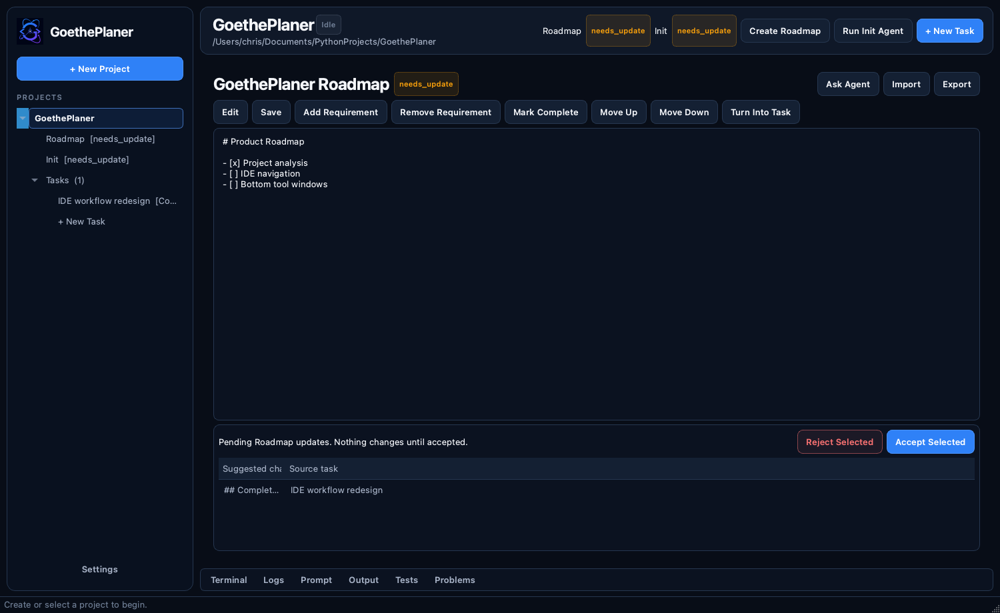

# GoethePlaner

GoethePlaner is a local PySide6 control center for OpenCode-based multi-agent
coding projects. It combines guided project onboarding, living Roadmap and Init
context, task planning, safe agent execution, and IDE-style runtime tools.

The application can run entirely in mock mode, so OpenCode is optional.



## Workflow

```text
Existing Project -> analyze docs and stack -> import or fill missing context
New Project -> goal -> Roadmap review -> Init review -> first task

Project Tree
  -> Roadmap
  -> Init
  -> Tasks
    -> selected agents
      -> Terminal / Logs / Prompt / Output / Tests / Problems
      -> reviewable Roadmap and Init update suggestions
```

1. Choose whether the project is existing or new.
2. Review repository analysis or complete guided Roadmap and Init onboarding.
3. Select the project, Roadmap, Init, or task from the left tree.
4. Create a task directly under its project and choose execution mode.
5. Monitor agents in the central task view and use bottom tool windows for
   runtime detail.
6. Accept or reject generated code changes.
7. Explicitly accept or reject Roadmap and Init update suggestions.

Projects and tasks are stored in memory in the current release.

## Features

- IDE-style project, Roadmap, Init, and task navigation tree
- Existing-project analysis and guided new-project onboarding
- First-class living Roadmap and Init resources
- Read-only documentation and language/framework detection
- Central registry of 17 professional agent roles
- Deterministic Planner recommendations with manual selection
- Agent-driven Roadmap and Init draft review
- Parallel mock implementation and safe sequential real OpenCode execution
- Per-agent status, progress, activity, logs, timing, and result state
- PyCharm-style Terminal, Logs, Prompt, Output, Tests, and Problems tools
- Reviewable post-task Roadmap and Init update suggestions
- Git baseline capture, changed-file summary, safe accept, and confirmed reject
- Responsive `QThread` workflows and streamed subprocess output

Diff and Review are intentionally not exposed as pages in this phase. Changed
file names remain available in Output, and safe Git reject behavior remains.

## Requirements

- Python 3.10 or newer
- Git for repository inspection and reject support
- OpenCode only when using Auto or OpenCode mode

## Setup

```bash
python3 -m venv .venv
source .venv/bin/activate
python -m pip install -r requirements.txt
```

## Launch

```bash
source .venv/bin/activate
python -m agentboard
```

The Python package retains the internal `agentboard` name for compatibility.

## Execution Modes

- `Auto`: uses OpenCode when available and otherwise uses mock mode.
- `Mock`: uses repository-aware local simulation and never invokes OpenCode.
- `OpenCode`: requires the configured executable and reports clear diagnostics
  when unavailable.

## Configuration

| Variable | Purpose | Default |
| --- | --- | --- |
| `AGENTBOARD_OPENCODE_COMMAND` | OpenCode command template | `opencode run --dir {repo_path} --agent {agent_name} {prompt}` |
| `AGENTBOARD_MOCK_DELAY` | Seconds per mock progress step | `0.2` |
| `AGENTBOARD_TEST_COMMAND` | Initial test command | Empty |
| `AGENTBOARD_OPENCODE_AGENT_MAP` | Optional internal-to-configured agent JSON | Empty |

Supported command placeholders are `{repo_path}`, `{agent_name}`, and `{prompt}`.
Commands are parsed into argument arrays and run with `shell=False`.

Internal roles map only to safe `plan` or `build` OpenCode agents unless an
explicit mapping is configured:

```bash
export AGENTBOARD_OPENCODE_AGENT_MAP='{"ml_engineer":"configured-ml"}'
```

## Project Creation

### Existing Project

GoethePlaner analyzes the selected folder without writing files. It detects
README, ROADMAP, ROADMAP.generated, AGENTS, AGENT, CLAUDE, TODO, pyproject,
package, and requirements files, common language/framework markers, Git state,
missing important documents, and suggested next actions.

The user chooses whether to import bounded document text into project context,
create a missing Roadmap, run Init when agent context is missing, or review
README improvements. Import never rewrites repository files.

### New Project

New projects require a name, target parent folder, and goal. Guided setup opens
the Roadmap Agent review first, then the Init Agent review. The project appears
in navigation only after the Roadmap is accepted and selected Init proposals
are confirmed and applied.

## Living Roadmap

Roadmap is always visible below its project. It supports:

- View, edit, and save
- Ask Agent, revise, regenerate, and accept draft
- Add or remove requirements
- Mark checklist items complete
- Move items up or down
- Turn a requirement into a task
- Import an existing Roadmap
- Export an accepted Roadmap
- Accept or reject post-task update suggestions

Roadmap states include missing, imported, draft, accepted, needs-update,
updated-after-task, and user-modified.

## Living Init

Init is always visible below its project. It represents project overview,
commands, tests, architecture, conventions, agent instructions, limitations,
important files, and current state.

The Init Agent proposes complete file contents and diffs without writing. Apply
requires selected files, confirmation, path-specific approval for updates, and
a stale-file check. Init states include missing, imported, draft, accepted,
stale, needs-update, updated-after-task, and user-modified.

## Task Completion Updates

Every completed task receives a completion summary. GoethePlaner then creates
one pending Roadmap suggestion and one pending Init suggestion. Project context
does not change until the user accepts a specific suggestion.

Suggestion acceptance updates in-memory context only. Repository documentation
still changes only through explicit Roadmap export or confirmed Init apply.

## IDE Workspace

The left tree is the single project and task navigator. The central workspace
switches among Project Overview, Roadmap, Init, and Task Detail.

The bottom strip contains `Terminal`, `Logs`, `Prompt`, `Output`, `Tests`, and
`Problems`. Only one tool opens at a time, selecting the active tool hides it,
and a vertical splitter controls its height.

## Agent Orchestration

Task creation includes a Plan step:

1. Optimize the original prompt.
2. Recommend specialized agents with deterministic rules.
3. Review rationale, permissions, risk, and execution graph.
4. Enable or disable optional agents.
5. Run the selected team.

Mock mode runs independent implementation agents concurrently. Test Engineer,
Code Reviewer, and Documentation Writer run afterward in dependency order. Real
OpenCode mode runs code-modifying stages sequentially in the shared repository.

## Safety

- No API keys are stored.
- No shell is used.
- No automatic commit, push, merge, or force push occurs.
- Existing-project analysis and import are read-only.
- Roadmap and Init draft generation are read-only.
- Roadmaps are not exported before acceptance.
- Init writes selected files only after confirmation.
- Existing Init targets require overwrite confirmation and stale-file checks.
- Task completion suggestions are never applied automatically.
- A Git baseline preserves pre-existing repository changes.
- Reject restores captured tracked paths and archives task-created files.

## Tests

```bash
source .venv/bin/activate
QT_QPA_PLATFORM=offscreen python -m unittest discover -v
```

The suite covers repository analysis, lifecycle state, update suggestions,
project-tree navigation, bottom tool toggling, removed panels, Roadmap
modification, draft review, safe export/apply, agent selection, mock and real
runner contracts, Git restoration, complete mock workflows, and headless Qt.

## Architecture

```text
agentboard/
  app/
    ui/
      sidebar.py          Project/resource/task tree
      workspace_views.py Project, Roadmap, Init, and Task Detail
      tool_windows.py     IDE-style bottom tools
      dialogs.py          Existing/New Project and New Task flows
      project_dialogs.py  Roadmap and Init agent review
      task_dashboard.py   Application shell
    core/
      project_analysis.py Read-only repository analysis/import
      project_updates.py  Reviewable completion suggestions
      project_agents.py   Context, prompts, parsing, and mock drafts
      task_manager.py     Staged workflow orchestration
      git_manager.py      Baseline, inspection, and scoped reject
    models/
      project.py
      project_lifecycle.py
      task.py
```

See [PRODUCT_REDESIGN.md](PRODUCT_REDESIGN.md), [UI_SPEC.md](UI_SPEC.md), and
[ROADMAP.md](ROADMAP.md).
